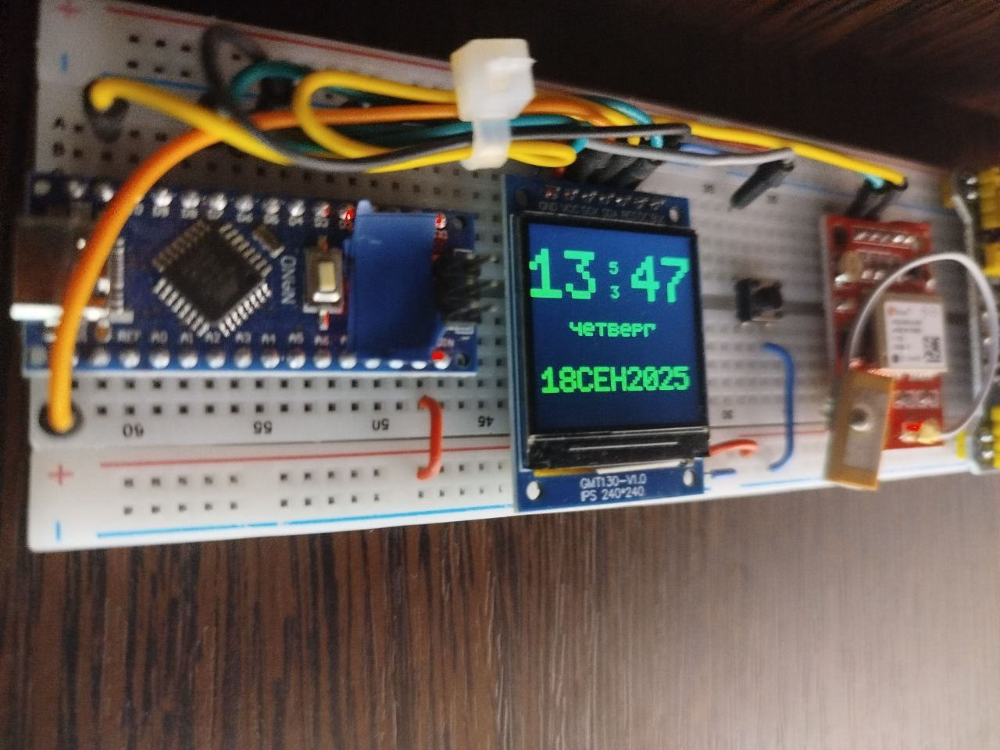
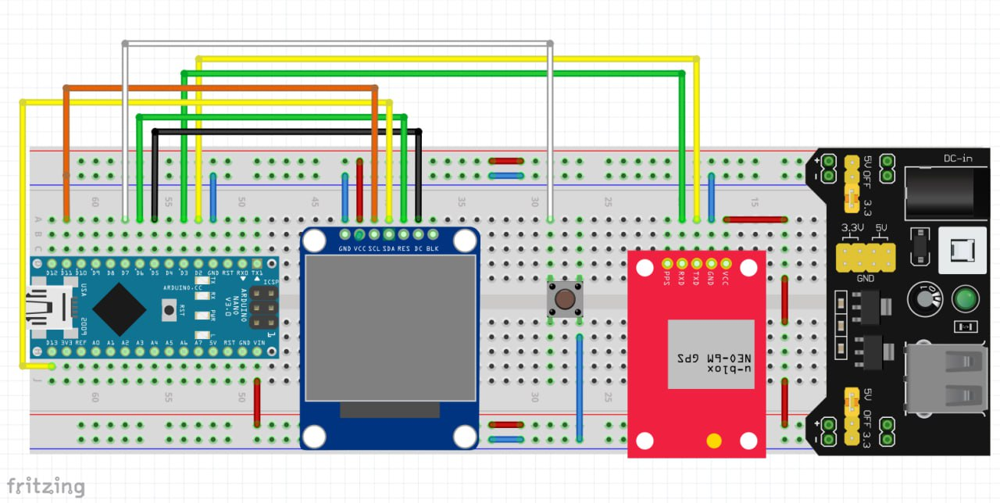

# Arduino GPS Clock Project
   
This repository contains the files and resources for building a GPS clock using an Arduino Nano and a TFT display.

## Files Included

- `gps_clock.fzz` (10.5 KB): Fritzing schematic for the circuit layout.
- `GPS_clock_main.ino` (5.5 KB): Main Arduino sketch for the GPS clock functionality.

## Hardware Requirements

- Arduino Nano
- GPS Neo-6M module
- TFT 1.3" display (240x240 resolution)

## Setup Instructions

1. Connect the components as shown in the `gps_clock.fzz` Fritzing schematic.
2. Upload the `GPS_clock_main.ino` sketch to the Arduino Nano using Arduino Studio.
3. Power on the setup and ensure the GPS module has a clear view of the sky for accurate time data.

## Usage

- The TFT display will show the current time synchronized with the GPS data.
- Ensure proper wiring and GPS signal reception for optimal performance.
   
